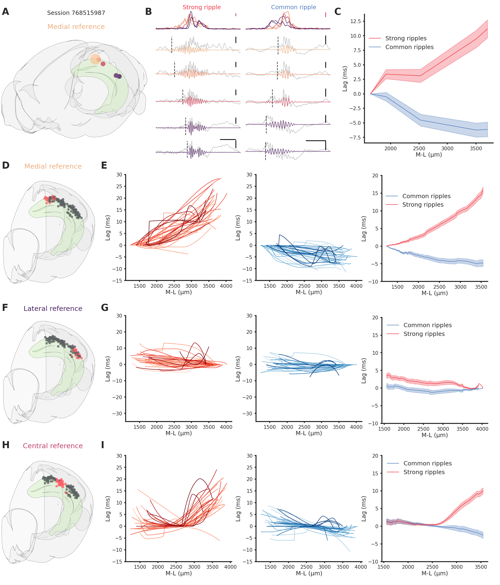
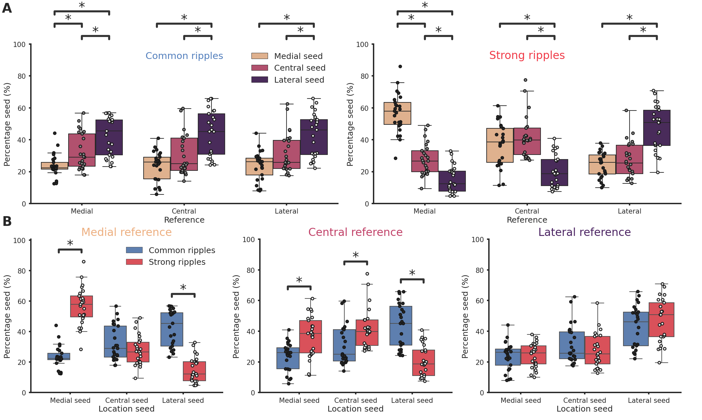

# Code for the reproduction of De Filippo et al., 2022.
The ***complete*** manuscript (text included) can be reproduced using the Python code present in this repository. Each number present in the text is an f-String that can be traced back to a data structure (see [PySciPaper](https://github.com/RobertoDF/PySciPaper)).

# Figures
Figure 1          |  Figure 2
:-------------------------:|:-------------------------:
 |  

Figure 3         |  Figure 4
:-------------------------:|:-------------------------:
 |  

### Instructions

1. Clone this repository and download the pre-computed data from ~~[here](10.6084/m9.figshare.20209913)~~ a private link (available to reviewers only). It will be public upon publication.
2. Open a terminal and cd to this repository `cd <De-Filippo-et-al-2022>`
3. Create conda environment: `conda create --name De-Filippo-et-al-2022 python=3.7` (if conda is not installed see [here](https://docs.conda.io/projects/conda/en/latest/user-guide/install/index.html)) and activate environment `conda activate De-Filippo-et-al-2022`
4. Install dependencies `pip install --no-deps -r requirements_analysis.txt`     
5. Change the `root_data` (location pre-computed data) and `root_github_repo` (location repository) variables in Utils/Settings.py
6. Reproduce figures by running the associated code, e.g. Figures/Figure_1/Figure_1.py (output in Output_figures folder). Reproduce text by running Manuscript/De_Filippo_et_al_2022.py (output in Manucript folder, see [here](https://github.com/RobertoDF/Pyscipaper))

All data can be recomputed from scratch with the functions provided in the Calculations folder, download the [Allen institute Neuropixel dataset](https://allensdk.readthedocs.io/en/latest/visual_coding_neuropixels.html) and change `neuropixel_dataset` in Utils/Settings.py.
If you want to recompute all the brain renderings using [Brainrender](https://github.com/brainglobe/brainrender), you will need the latest version available on github (not yet on pip).

## Main figures data processing flow
Blue cylinder = database, Pink boxes = algorithms, Blue boxes = data structures. 

## Supplementary figures data processing flow

